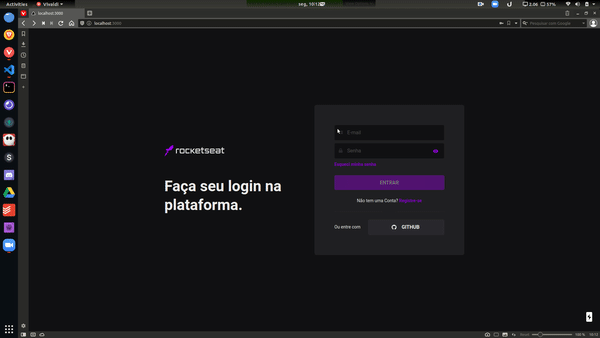

# Skylab Clone

#### Projeto de clone UI utilizando NextJS e Design Systems.

## Funconamento

O Skylabclone foi desenvolvido para treinar conhecimentos com Declarative UI, Design Systems e NextJS.

## Resumo
**Declarative UI:** Basicamente é a capacidade de dar estilização ao HTML, assim já ao declarar a estrutura da página você tambem declara a estilização
e funcionalidade daquela tag, tais como: Containers, Buttons, Input. Dando uma melhor noção do que a página vai mostrar já ao ler a estrutura

**Design Systems:** Resumidamente é um conjunto de regras e componentes já definidos para facilitar o desenvolvimento de uma interface mais limpa e padronizada.


## Tecnologias Utilizadas:

- NextJS
- Chakra UI
- Frame Motion


## Demo da Aplicação:



## Como Rodar?

Faça o clone da aplicação e coloque na pasta de sua preferência.

Dentro da raiz do projeto utilize o comando para baixar os pacotes do projeto:

```bash
npm install
# or
yarn
```

Após isso utilize o comando para iniciar o projeto:

```bash
npm run dev
# or
yarn dev
```


<h4 align="center">
	<i>God is Beyond Everything</i>
</h4>
